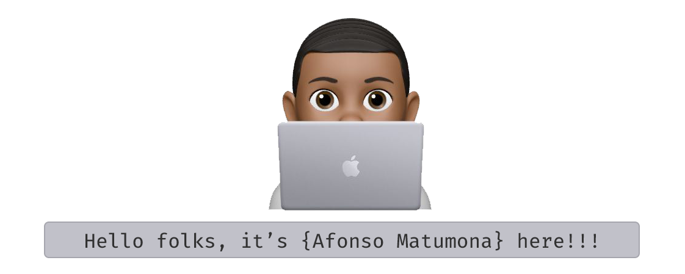

  

---

  

 

Hi! My name is **Afonso Matumona** aka **Elias**, fullstack developer but mostly focused on backend development.

  I'm the creator of <a target="_blank" href="https://bouerjs.github.io">Bouer.js</a>, a frontend library for developing Web Apps.

 

<h2 align="center"> Welcome to my Github profile </h2>

 

## 🔥 Streak stats

  
  
🔥 Get streak stats for your profile at <a href="https://git.io/streak-stats">git.io/streak-stats</a>

 

## 🛠️ My favorite tools

 

### 👨‍💻 Programming Languages

    
    
    
    
    
    
    
    
    
    
    
    
    
    
    

### 🧰 Frameworks and Libraries

    
    
    
    
    
    
    
    

### 🗄️ Databases and Cloud hosting

    
    
    
    
    
    

### 💻 Software and Tools

    
    
    
    
    
    
    
    
    
    
    
    

## 📱 Connect with me

   
   
   
   
   
   

Or, you can mail me at 📨 **afonsomatumona@hotmail.com**

 

## 💻 GitHub Profile Stats

<!-- https://github.com/anuraghazra/github-readme-stats -->

 

  

    I have a friend (<a href="https://github.com/Hequele">Salomão Satuta</a>) that said: I don't know about you but, as a coder, when I'm among people that does not code, 
    I feel like a god 👨‍🦳, like, I'm invincible 🏋️ or a super-hero 🦸! If you feel this way too, welcome to the family ❤️!!!
  

   
  <h3> Thanks for your visit 🙏!!! </h3>
   
  
  <h2> Salute ✌️😎 </h2>

